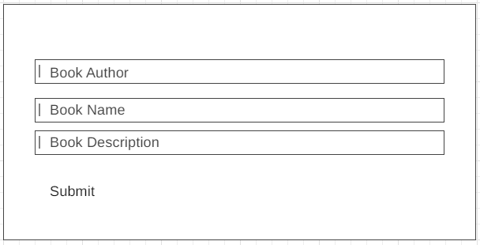
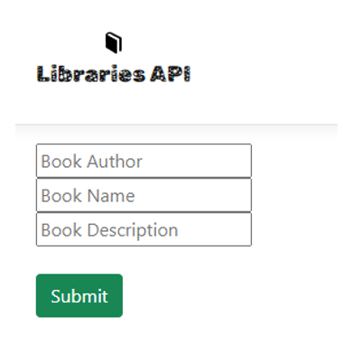
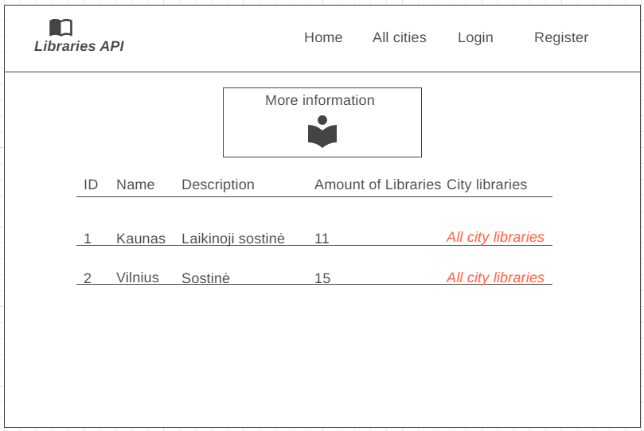
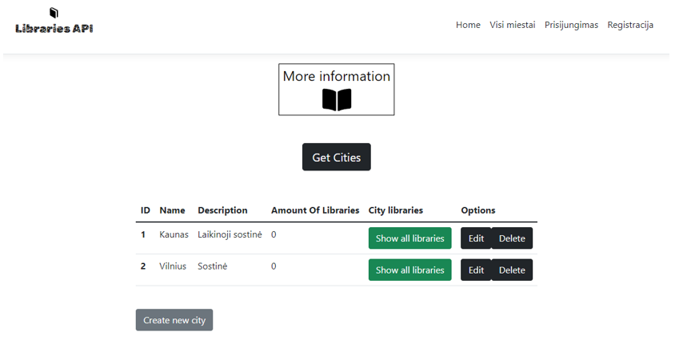
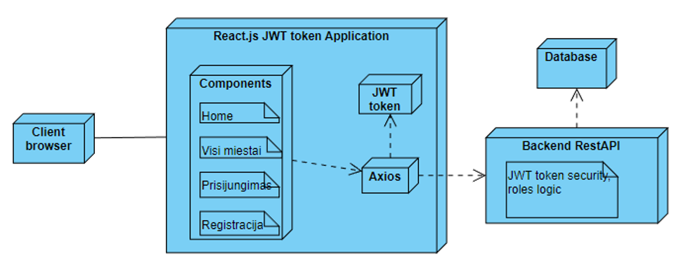

# Rest API Libraries
**Pirminė projekto saugykla**
```
https://github.com/PauliusJod/RestLibraries
```
Saugykla buvo pakeista dėl react.js patogesnio pridėjimo prie projekto.


**Projekto tikslas**
```
Projekto tikslas buvo sukurti API, kuriame galima matyti ir valdyti, pridėti ir redaguoti skirtingus sistemos lygmenis, t.y.: miestus, bibliotekas, knygas. Taip pat būtų galima rezervuoti knygas atsiėmimui bibliotekoje. Visa tai pateikti patogioje „frontend“ dalyje, paruoštoje savo pasirinktu įrankiu – react.js 
```

**Iškelti uždaviniai**
```
Leisti rezervuoti knygą pagal pasirinktą miestą, biblioteką.
Kiekvienam naudotojui prisijungus priskirti žetoną (token).
Pilnai veikiančios CRUD struktūros su kiekviena duomenų lentele. CRUD apribotas įtraukiant sistemoje esančias naudotojų roles.
Sistemos atvaizdavimą sukūrti patogų, paprastą naudotis visiems vartotojams bei paįvairinti jį su skirtingais html, js funkcionalumais.
```

**Sistemos architektūra**
```
Naudotojai mato daug funkcionalumą suteikiančių mygtukų, tačiau daugumos jų naudojimas yra tikrinamas JWT žetono pagalba ir gražinama klaida į naršyklės išvesties lauką, arba vartotojas nukeliamas į kitą langą su jau atlikto veiksmo pakeitimais.
```










| API funkcija  | Register |
| ------------- | ------------- |
| Paskirtis | Naudojama registruojantis naujam vartotojui, po registracijos naujas vartotojas nėra prisijungęs. |
| Endpoint | api/register |
| Užklausos struktūra JSON | { "userName": "paulius55", "email": "paulius55@gmail.com", "password": "!Paulius.2022" } |
| Žetonas | Išduodamas tik naudotojui prisijungiant! |
| Atsakymo kodas | Created - 201 |
| Atsakymo struktūra JSON | { "id": "8ee549de-a988-4354-8545-5f3681bf478f", "userName": "paulius55", "email": "paulius55@gmail.com" } |
| Neigiamas atsakymo kodas | Bad Request - 400 |


| API funkcija  | Login |
| ------------- | ------------- |
| Paskirtis | Naudojama visų rolių naudotojų prisijungiant prie sistemos. |
| Endpoint | api/login |
| Užklausos struktūra JSON | { "userName": "Paulius55", "password": "!Paulius.2022" } |
| Žetonas | Išduodamas žetonas (token) naudotojui prisijungiant! |
| Atsakymo kodas | Ok - 200 |
| Atsakymo struktūra JSON | { "accessToken": "eyJhbGciOiJIUzI1NiIsInR5cCI6IkpXVCJ9.eyJodHRwOi8vc2NoZW1hcy54bWxzb2FwLm9yZy93cy 8yMDA1LzA1L2lkZW50aXR5L2NsYWltcy9uYW1lIjoicGF1bGl1czU1IiwianRpIjoi ODM0ZGI2ODYtMWQxNy00ZDI5LTgyNDItMTQ4OTEyN2I2ZTYyIiwic3ViIjoiOGVlNTQ5ZGUtYT k4OC00MzU0LTg1NDUtNWYzNjgxYmY0NzhmIiwiaHR0cDovL3NjaGVtYXMu bWljcm9zb2Z0LmNvbS93cy8yMDA4LzA2L2lkZW50aXR5L2NsYWlt cy9yb2xlIjoiTGlicmFyeVVzZXIiLCJleHAiOjE2NzE3MDI2Mz MsImlzcyI6IlJlYWN0SXNzdWVyIiwiYXVkIjoiVHJ1c3RlZENsaWVudCJ9. hlawqsa_jiAVEHhYacp7SWROcvaxvEHiOW45x-7m6s8" } |
| Neigiamas atsakymo kodas | Bad Request - 400 |


| API funkcija  | Get Cities |
| ------------- | ------------- |
| Paskirtis | Naudojama gauti visų registruotų miestų sistemoje sąrašą. |
| Endpoint | api/cities |
| Žetonas | Žetonas nėra tikrinamas. |
| Atsakymo kodas | Ok - 200 |
| Atsakymo struktūra JSON (pvz) | [{ "id": 1, "name": "Kaunas", "description": "Laikinoji sostinė", "amountOfLibraries": 0 }, { "id": 2, "name": "Vilnius", "description": "Sostinė", "amountOfLibraries": 0 }] |
| Neigiamas atsakymo kodas | No Content - 204 |

| API funkcija  | Get City |
| ------------- | ------------- |
| Paskirtis | Naudojama gauti vieną pasirinktą (pagal id) registruotą miestą sistemoje. |
| Endpoint | api/cities/{cityid} |
| Atsakymo kodas | Ok - 200 |
| Atsakymo struktūra JSON (pvz) | { "id": 1, "name": "Kaunas", "description": "TESTCHANGE", "amountOfLibraries": 0 } |
| Neigiamas atsakymo kodas | Not Found - 404 |

| API funkcija  | Create (city) |
| ------------- | ------------- |
| Paskirtis  | Naudojama norint sukūrti naują miestą sąraše. |
| Reikalinga rolė sistemoje  | LibraryUser |
| Endpoint  | api/cities |
| Užklausos struktūra JSON  | { "Name": "Test miestas 2", "Description": "Miestas" } |
| Žetonas  | Žetonas siunčiamas iš frontend, per axios užklausą: headers: {'Authorization': `Bearer ${a.accessToken}`}. Backend tikrinama žetone slypinti informacija apie naudotojo rolę. |
| Atsakymo kodas  | Created - 201 |
| Atsakymo struktūra JSON (pvz) | { "name": "Test miestas 2", "description": "Miestas" } |
| Neigiamas atsakymo kodas - netinkama rolė žetone  | Forbidden - 403 |
| Neigiamas atsakymo kodas - netinkamas token'as arba jo nėra  | Unauthorized - 401 |

| API funkcija  | Update (city) |
| ------------- | ------------- |
| Paskirtis  | Naudojama norint pakeisti miesto aprašymą. |
| Reikalinga rolė sistemoje  | Admin |
| Endpoint  | api/cities/{cityid} |
| Užklausos struktūra JSON  | { "Description": "TESTCHANGE" } |
| Žetonas  | Žetonas siunčiamas iš frontend, per axios užklausą: headers: {'Authorization': `Bearer ${a.accessToken}`}. Backend tikrinama žetone slypinti informacija apie naudotojo rolę. |
| Atsakymo kodas  | Ok - 200 |
| Atsakymo struktūra JSON (pvz) | { "id": 1, "name": "Kaunas", "description": "TESTCHANGE", "amountOfLibraries": 0 } |
| Neigiamas atsakymo kodas - netinkama rolė žetone  | Forbidden - 403 |
| Neigiamas atsakymo kodas - netinkamas token'as arba jo nėra  | Unauthorized - 401 |

| API funkcija  | Delete (city) |
| ------------- | ------------- |
| Paskirtis  | Naudojama norint ištrinti miestą iš sąrašo. |
| Reikalinga rolė sistemoje  | Admin |
| Endpoint  | api/cities/{cityid} |
| Žetonas  | Žetonas siunčiamas iš frontend, per axios užklausą: headers: {'Authorization': `Bearer ${a.accessToken}`}. Backend tikrinama žetone slypinti informacija apie naudotojo rolę. |
| Atsakymo kodas  | No Content - 204 |
| Atsakymo struktūra JSON (pvz) | Nėra |
| Neigiamas atsakymo kodas - netinkama rolė žetone | Forbidden - 403 |
| Neigiamas atsakymo kodas - netinkamas token'as arba jo nėra | Unauthorized - 401 |
| Neigiamas atsakymo kodas - miesto su pasirinktu ID nėra | Not Found - 404 |


| API funkcija  | Get Libraries |
| ------------- | ------------- |
| Paskirtis | Naudojama gauti visų registruotų miesto bibliotekų sistemoje sąrašą. |
| Endpoint | api/cities/{cityId}/libraries |
| Žetonas | Žetonas nėra tikrinamas. |
| Atsakymo kodas | Ok - 200 |
| Atsakymo struktūra JSON (pvz) | [{"id": 2, "libraryName": "Biblioteka", "libraryBookedBooks": 0 },{ "id": 3, "libraryName": "Biblioteka", "libraryBookedBooks": 0 }] |
| Neigiamas atsakymo kodas | Nėra |

| API funkcija  | Get Library |
| ------------- | ------------- |
| Paskirtis | Naudojama gauti vieną pasirinktą (pagal id) registruotą miesto biblioteką. |
| Endpoint | api/cities/{cityId}/libraries/{libraryId} |
| Atsakymo kodas | Ok - 200 |
| Atsakymo struktūra JSON (pvz) | { "id": 2, "libraryName": "Biblioteka", "libraryBookedBooks": 0 } |
| Neigiamas atsakymo kodas | Not Found - 404 |

| API funkcija  | Create (library) |
| ------------- | ------------- |
| Paskirtis  | Naudojama norint sukūrti naują biblioteką, miesto sąraše. |
| Endpoint  | api/cities/{cityId}/libraries |
| Užklausos struktūra JSON  | { "libraryName": "Biblioteka" } |
| Atsakymo kodas  | Created - 201 |
| Atsakymo struktūra JSON (pvz) | { "libraryName": "Biblioteka" } |
| Neigiamas atsakymo kodas - nerastas miesto id  | Not Found - 404 |
| Neigiamas atsakymo kodas - blogi išsiunčiami duomenys  | Bad Request - 400 |

| API funkcija  | Update (library) |
| ------------- | ------------- |
| Paskirtis | Naudojama norint pakeisti bibliotekos aprašymą. |
| Reikalinga rolė sistemoje | Admin |
| Endpoint | api/cities/{cityId}/libraries/{libraryId} |
| Užklausos struktūra JSON | { "libraryName": "Biblioteka-update" } |
| Žetonas | Žetonas siunčiamas iš frontend, per axios užklausą: headers: {'Authorization': `Bearer ${a.accessToken}`}. Backend tikrinama žetone slypinti informacija apie naudotojo rolę. |
| Atsakymo kodas | Ok - 200 |
| Atsakymo struktūra JSON (pvz) | { "id": 2, "libraryName": "Biblioteka-update", "libraryBookedBooks": 0 } |
| Neigiamas atsakymo kodas - netinkama rolė žetone | Forbidden - 403 |
| Neigiamas atsakymo kodas - netinkamas token'as arba jo nėra | Unauthorized - 401 |

| API funkcija  | Delete (library) |
| ------------- | ------------- |
| Paskirtis  | Naudojama norint ištrinti biblioteką iš miesto sąrašo. |
| Reikalinga rolė sistemoje  | Admin |
| Endpoint  | api/cities/{cityId}/libraries/{libraryId} |
| Žetonas  | Žetonas siunčiamas iš frontend, per axios užklausą: headers: {'Authorization': `Bearer ${a.accessToken}`}. Backend tikrinama žetone slypinti informacija apie naudotojo rolę. |
| Atsakymo kodas  | No Content - 204 |
| Atsakymo struktūra JSON (pvz) | Nėra |
| Neigiamas atsakymo kodas - netinkama rolė žetone | Forbidden - 403 |
| Neigiamas atsakymo kodas - netinkamas token'as arba jo nėra | Unauthorized - 401 |
| Neigiamas atsakymo kodas - miesto su pasirinktu ID nėra | Not Found - 404 |


**Projekte naudojamas JWT token, jo algoritmas: HS256**<br><br>
**Iššifruoto žetono pavyzdys:**
```
Header
{
  "alg": "HS256",
  "typ": "JWT"
}
PAYLOAD
{
  "http://schemas.xmlsoap.org/ws/2005/05/identity/claims/name": "paulius55",
  "jti": "834db686-1d17-4d29-8242-1489127b6e62",
  "sub": "8ee549de-a988-4354-8545-5f3681bf478f",
  "http://schemas.microsoft.com/ws/2008/06/identity/claims/role": "LibraryUser",
  "exp": 1671702633,
  "iss": "ReactIssuer",
  "aud": "TrustedClient"
}
```

**Projekto išvados**
```
Projektas nėra pilnai išbaigtas, tačiau tai stabilus pagrindas jo plėtrai. Naudojami JWT žetonai suteikia sistemos saugumo ir jo funkcionalumo. Sistemos lygiai „Miestas -> Biblioteka -> Knyga“ gali leisti skirstyti vartotojus pagal jų profilius į miestus ar jiems priskirtas bibliotekas. Taip pat plėtojant sistemą galima apriboti rezervuojamų knygų kiekį vienam vartotojui. JavaScript biblioteka – React.js leidžia patogiai redaguoti vartotojo sąsają, galima apriboti pateikiamo funkcionalumo kiekį pagal naudotojo rolių skirstymą.
```
